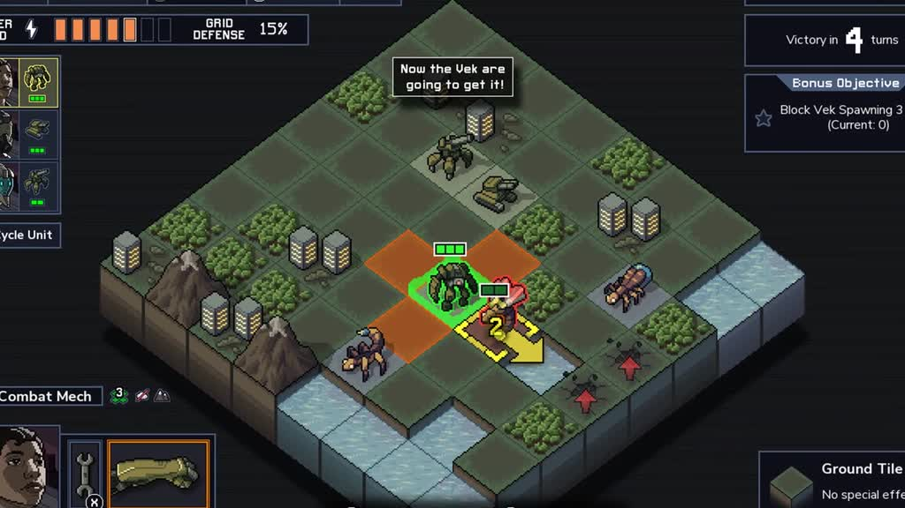
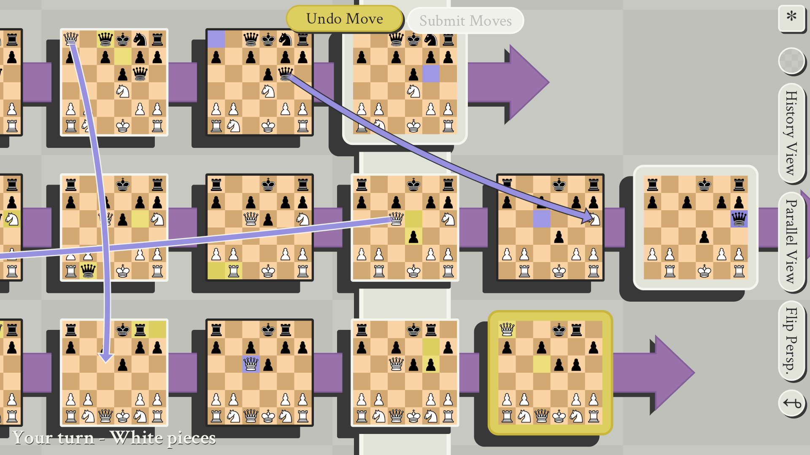
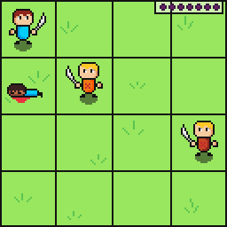
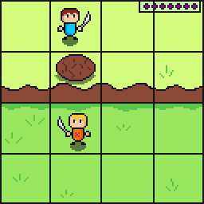
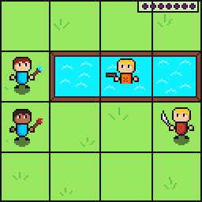
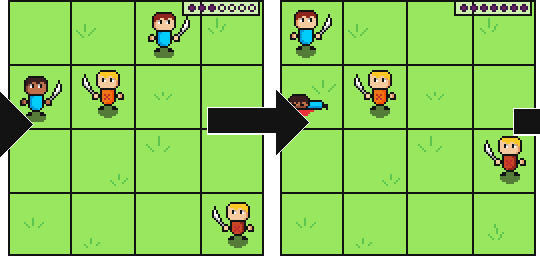
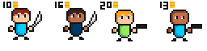
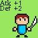

# Time Jumpers - Design Doc

## Table of Contents
1. [Introduction](#introduction)
	1. [Summary](#summary)
	2. [Inspirations](#inspirations)
	3. [Mechanics](#mechanics)
	4. [Platforms](#platforms)
	5. [Development Software](#development-software)
	6. [Genre](#genre)
	7. [Target Audience](#target-audience)
2. [Concept](#concept)
	1. [Gameplay Overview](#gameplay-overview)
	2. [Primary Mechanics](#primary-mechanics)
	3. [Secondary Mechanics](#secondary-mechanics)
3. [Art](#art)
4. [Music](#music)
5. [Game Experience](#game-experience)
	1. [Controls](#controls)
	2. [UI](#ui)
6. [Development Timeline](#development-timeline)

## Introduction
### Summary
Time Jumpers is a strategy game where players can send units back in time to hold more advantageous positions and complete the main goal: defeat the enemies' commander.

### Inspirations
#### Into the Breach

`Into the Breach` is the main inspiration for the tactics gameplay of `Time Jump`. In `Into the Breach`, the player takes control of 3 mechs whose objective is to protect civilian builds and defeat the `Vek` invasion. Players can manipulate enemy positions through attacks and a few weapons to make enemies miss attacks, attack themselves or even fall into environmental hazards, such as water, fire and mines. Some actions may leave side-effects on the field, such as burning trees, creating fire, or making smoke, making an unit not be able to attack if on a smoke tile.

#### 5D Chess with Multiverse Time Travel

`5D Chess with Multiverse Time Travel` (`5D Chess` for short) is a chess game where players can time-travel and create different branching timelines of the game. A player wins by doing a check-mate in any of the created timelines.

### Main Gameplay Loop
A single run will take between 20 to 30 maps where the player will need to defeat the enemy commander to proceed. The player must use the time travel mechanic to get to more advantageous positioning and use the environment to make the enemies take heavy damage. Each unit has a different set of strengths and weakness and can interact with the environment in different ways. The enemies will also use the time traveling mechanics and environment to try to defeat the player commander.

### Platforms
The is set to be released on Windows and Linux.

### Development Software
- `Godot` for programming
- `Aseprite` for Sprites and UI
- `LMMS` for music and sound effects

### Genre
Strategy RPG, Roguelite, Singleplayer

### Target Audience
SRPG and Roguelite fans that want to try a new take on the Strategy genre.

## Concept
### Gameplay Overview
The player controls a battle unit with a commander against an AI battle unit with its own commander. The game is won by taking down the opposing commander. Casualties are taken between rounds, however, when an unit time-travels, any casualties which happened after the turn in which the unit has traveled back into is overwritten, making players think when to sacrifice units to hold better positions.

To time travel, the player must spend a resource which works a little bit like `mana` in card games - it increases by 1 each turn until the first time travel; then it slows down and increases by 0.75. Subsequent travels will decrease the value increase by 0.25 each time. Enemy units are bound to the same mechanic, but they may start with less or more `mana`.

Besides traveling in time to past turns, units can interact with the environment by setting fires, electrocute enemies in water or other conductive surfaces, move units so they miss attacks or attack themselves and more. 

All enemy actions are telegraphed to the player so he/she can always make the optimal decision in a turn.

### Primary Mechanics

| Mechanic | Animated Mockup (Art not final) |
| :-------- | -------------------------------: |
| **Time Travel**: When the time travel bar is full, the player can select an unit and send it back to a previous turn. | |
| **Object Interaction**: Some objects can be interacted with to set up traps or to damage enemies. |  |
| **Attack Interaction**: Some attacks interact with the environment, such as electric attacks electrocuting units in conductive surface, fire attacks burning grass, ice attacks freezing water and preventing units to move, etc. |  |

### Secondary Mechanics
| Mechanic | Animated Mockup (Art not final) |
| :-------- | -------------------------------: |
| **Timeline Viewer**: When the player selects the option to go back in time, a view similar to the multiverse view in `5D chess` is presented, where the player can see which points in space-time the selected unit can move to. |  |
| **Unit Acquisition**: To acquire new units the player must spend gold. If the player performs well in a battle (e.g. losses few units, quickly finishes the battle) then the available units to acquire will be discounted. The player may also leave units behind if his team is full. When a unit is left behind it will pay the player a small amount. |  |
| **Level Ups**: Units will level up and increase its stats as they fight. They may also learn new moves. Experience is gained by attacking and defeating enemy units. |  |

## Art

## Audio
The game will use a synth soundtrack, inspired by the synthwave genre and `Hotline Miami`. It also fits well with LMMS capabilities.

## Game Experience
### Controls
The game uses the mouse to select the units and draw its movement path. To select which action to take (move, attack, use item) a radial wheel is used with optional keyboard bindings if the player doesn't wish to use the mouse.

### UI

## Development Timeline

| Assignment | Status |
|------------|--------|
| Create first world random level generator | Done |
| Create fire shader | Done |
| Create water shader | Done |
| Create ice block/shader | - |
| Make player movement | - |
| Make attack animations (fire, ice, water, electric, wind and grass) | - |
| Make enemy movement | - |
| Make enemy AI | - |
| Make run away NPCs AI | - |
| Create second world random level generator | Done |
| Create third world random level generator | Done |